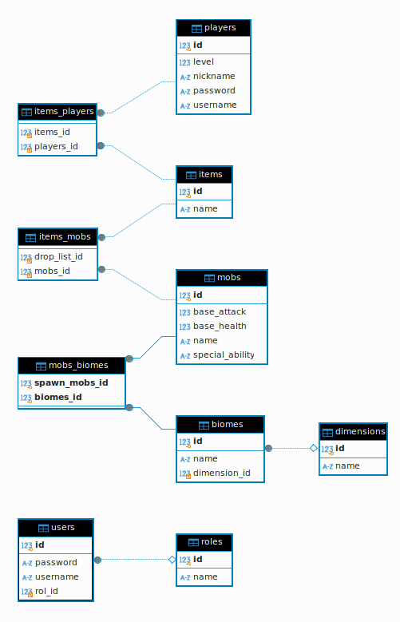

# Minecraft API - Proyecto Spring Boot

Este proyecto es una API RESTful desarrollada con Spring Boot para manejar entidades relacionadas con el mundo de Minecraft. Permite gestionar datos como dimensiones, biomas, jugadores, ítems, mobs, y roles, interactuando con una base de datos.

## Estructura del Proyecto

El proyecto sigue una estructura limpia y modular:

```
api/
   dto/           # Clases Data Transfer Object para trasladar datos entre capas
   mappers/       # Mapstruct para convertir entidades a DTOs y viceversa
controller/
   interfaces/    # Controladores que manejan las solicitudes HTTP
model/
   entity/        # Entidades que representan las tablas de la base de datos
   repository/    # Repositorios que interactúan directamente con la base de datos
services/         # Lógica de negocio y endpoints principales
```

### Descripción de Carpetas

1. **api/dto**: Aquí se definen los DTOs que representan la estructura de los datos enviados o recibidos a través de la API.
2. **api/mappers**: Contiene las clases generadas por MapStruct para convertir objetos de tipo entidad a DTO y viceversa.
3. **controller/interfaces**: Los controladores reciben y manejan las solicitudes HTTP, delegándolas a los servicios.
4. **model/entity**: Define las entidades que reflejan las tablas de la base de datos.
5. **model/repository**: Contiene interfaces que extienden JpaRepository para realizar consultas a la base de datos.
6. **services**: Implementa la lógica de negocio y las operaciones principales de la API.

## Endpoints Disponibles

### Biomes
- **GET /api/v1/biomes**: Obtiene todos los biomas.
- **GET /api/v1/biomes/{id}**: Obtiene un bioma por su ID.
- **POST /api/v1/biomes**: Crea un nuevo bioma.
- **DELETE /api/v1/biomes/{id}**: Elimina un bioma por su ID.

### Dimensions
- **GET /api/v1/dimensions**: Obtiene todas las dimensiones.
- **GET /api/v1/dimensions/{id}**: Obtiene una dimensión por su ID.
- **POST /api/v1/dimensions**: Crea una nueva dimensión.
- **DELETE /api/v1/dimensions/{id}**: Elimina una dimensión por su ID.

### Players
- **GET /api/v1/players**: Obtiene todos los jugadores.
- **GET /api/v1/players/{id}**: Obtiene un jugador por su ID.
- **POST /api/v1/players**: Crea un nuevo jugador.
- **DELETE /api/v1/players/{id}**: Elimina un jugador por su ID.

### Mobs
- **GET /api/v1/mobs**: Obtiene todos los mobs.
- **GET /api/v1/mobs/{id}**: Obtiene un mob por su ID.
- **POST /api/v1/mobs**: Crea un nuevo mob.
- **DELETE /api/v1/mobs/{id}**: Elimina un mob por su ID.

### Items
- **GET /api/v1/items**: Obtiene todos los ítems.
- **GET /api/v1/items/{id}**: Obtiene un item por su ID.
- **POST /api/v1/items**: Crea un nuevo ítem.
- **DELETE /api/v1/items/{id}**: Elimina un item por su ID.

### Users
- **GET /api/v1/users**: Obtiene todos los usuarios.
- **GET /api/v1/users/{id}**: Obtiene un usuario por su ID.
- **POST /api/v1/users**: Crea un nuevo usuario.
- **DELETE /api/v1/users/{id}**: Elimina un user por su ID.


### Roles
- **GET /api/v1/roles**: Obtiene todos los roles.
- **GET /api/v1/roles/{id}**: Obtiene un rol por su ID.
- **POST /api/v1/roles**: Crea un nuevo rol.
- **DELETE /api/v1/roles/{id}**: Elimina un rol por su ID.

## Ejemplo de Lógica en el Servicio: Guardar un Jugador

El siguiente ejemplo muestra cómo funciona el método `save` para jugadores. Este método verifica las IDs, vincula los ítems a los jugadores, y asegura la persistencia de datos:

```java
@Override
public PlayerDto save(PlayerDto playerDto) {
    List<Item> items = new ArrayList<>();
    Player player = PlayerMapper.INSTANCE.toPlayer(playerDto);
    for (ItemDto itemDto : playerDto.getItems()) {
        Optional<Item> itemOptional = iItemRepository.findById(itemDto.getId());
        if (itemOptional.isPresent()) {
            Item item = itemOptional.get();
            items.add(item);
            if (item.getPlayers() == null) {
                item.setPlayers(new ArrayList<>());
            }
            item.getPlayers().add(player);
        }
    }
    player.setItems(items);
    return PlayerMapper.INSTANCE.toPlayerDto(iPlayerRepository.save(player));
}
```

### Explicación
1. **Conversión DTO a Entidad**: Se utiliza `PlayerMapper` para convertir `PlayerDto` a una entidad `Player`.
2. **Asociación con Ítems**: Busca los ítems por ID y los vincula al jugador.
3. **Persistencia**: Guarda el jugador y retorna el objeto convertido nuevamente a DTO.

## Requisitos para Correr el Proyecto
- Java 11+
- Maven 3.6+
- Base de datos compatible con JPA (ejemplo: MySQL, H2, PostgreSQL)
He añadido un apartado sobre tecnologías basándome en las dependencias y configuraciones que has proporcionado. Aquí está el texto actualizado:

---
## Estructura de la Base de Datos

---
## Tecnologías Utilizadas 💻

El proyecto utiliza las siguientes tecnologías y herramientas:

- **Java 17** ☕: Lenguaje principal para el desarrollo del proyecto.
- **Spring Boot 3.3.0** 🚀: Framework para crear aplicaciones Java rápidas y robustas.
  - *Spring Data JPA*: Para interactuar con la base de datos mediante ORM.
  - *Spring Web*: Para la creación de endpoints REST.
  - *SpringDoc OpenAPI* 📄: Para documentar y probar la API con Swagger UI.
- **MapStruct 1.5.5** 🗺️: Biblioteca para mapear automáticamente entidades a DTOs.
- **MySQL 8.0.22** 🗄️: Base de datos principal del proyecto.
- **Jacoco** 📊: Herramienta para medir la cobertura de pruebas.
- **Maven** 📦: Sistema de gestión de dependencias y compilación.
- **Tomcat** 🐱: Servidor embebido para ejecutar la aplicación.

Estas herramientas trabajan en conjunto para garantizar un desarrollo eficiente, organizado y con buenas prácticas.

---

### Configuración
1. Configura el archivo `application.properties` para conectar con tu base de datos:

```properties
spring.datasource.url=jdbc:mysql://localhost:3306/minecraft
spring.datasource.username=root
spring.datasource.password=password
spring.jpa.hibernate.ddl-auto=update
```

2. Compila y ejecuta el proyecto:

```bash
mvn spring-boot:run
```

